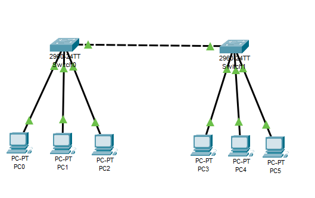
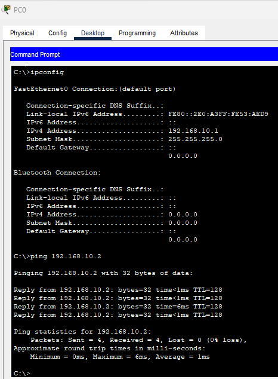
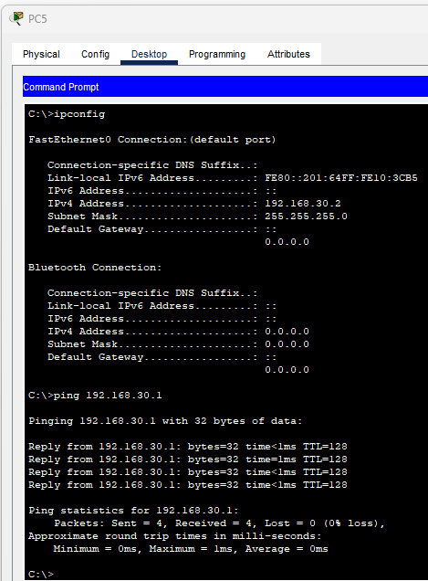
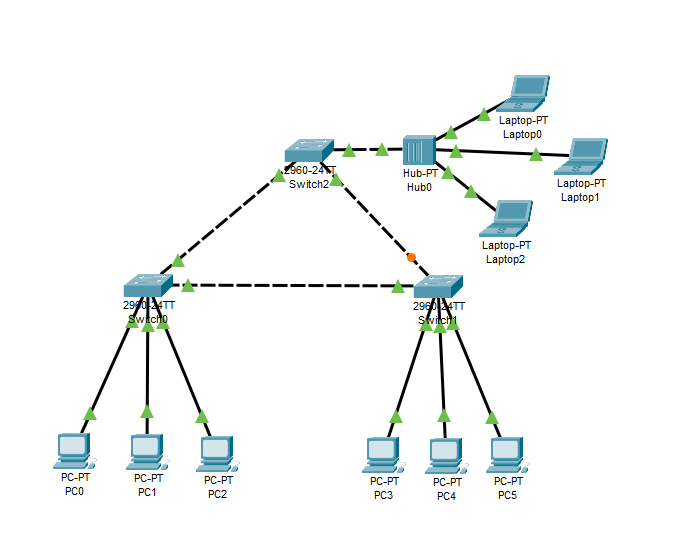
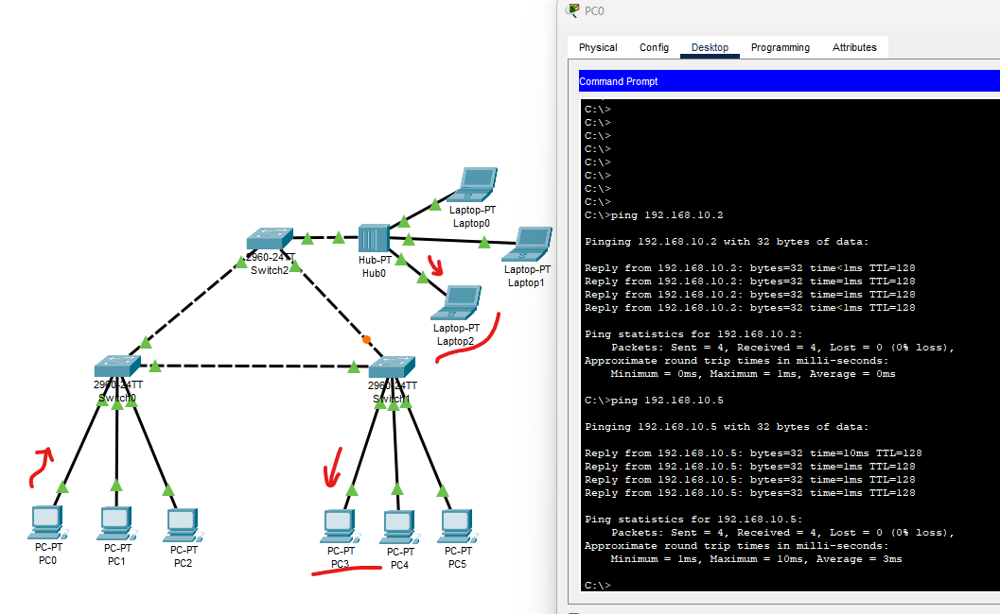
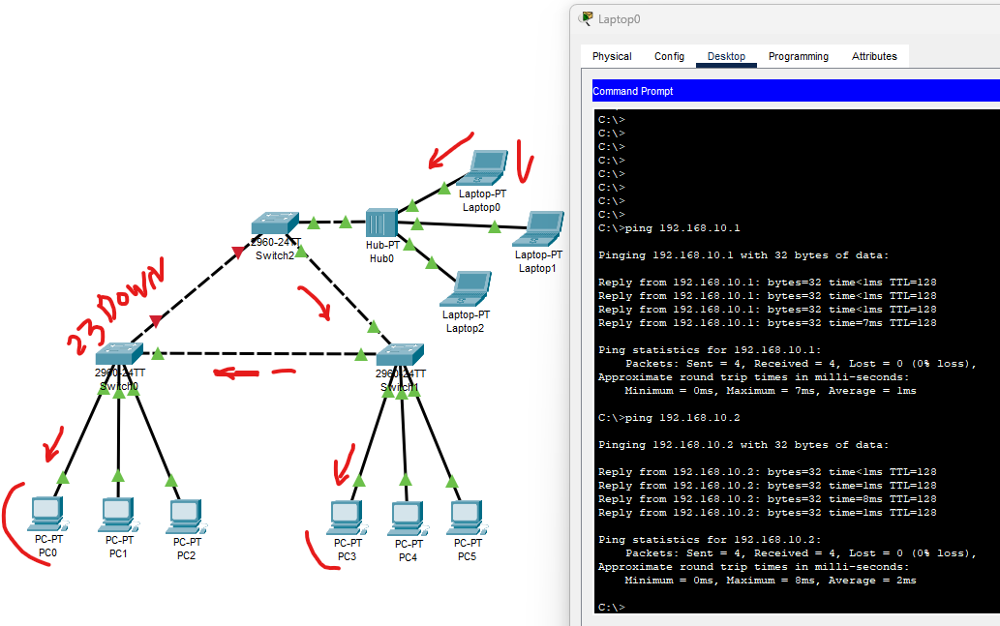

### Задание 1. Сборка локальной сети

Описание задания:  
Вам нужно собрать небольшую локальную сеть, состоящую из шести компьютеров. На устройствах работают сотрудники из трёх разных отделов, необходимо изолировать их друг от друга.

*Ответ:*  
[Файл .pkt](_attachments/04.02-1-cpt.pkt)

Схема сети  

Проверка доступности vlan 10

Проверка доступности vlan 20  

Проверка доступности vlan 30  

Сколько широковещательных доменов у вас получилось?  
Каждый VLAN — это один широковещательный домен, поэтому в этом случае их 3.

### Задание 2. Подключение дополнительных устройств к локальной сети

Описание задания:  
Вам нужно подключить три дополнительных ноутбука к одному из отделов. Отдельное условие - до дополнительных рабочих мест нужно организовать резервный канал. Это позволит эффективнее решать задачи и не зависеть от сетевых проблем.

*Ответ:*  
[Файл .pkt](_attachments/04.02-2-cpt.pkt)  

Схема сети  

Работа с резервным каналом, протокол STP:  

Имитация неисправности одного канала связи:  

В чём преимущества и недостатки этой сети?  
- Преимущество - в наличии резервного канала связи для vlan10;
- Недостаток - нет (не настроен) резервного канала для vlan 20 и 30.