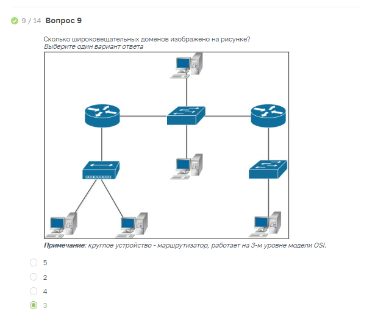

### Задание 1. Сборка локальной сети

Описание задания:  
Вам нужно собрать небольшую локальную сеть, состоящую из шести компьютеров. На устройствах работают сотрудники из трёх разных отделов, необходимо изолировать их друг от друга.

*Ответ:*  
[Файл .pkt](_attachments/04.02-1-cpt.pkt)

Настройка коммутатора  
```
en
conf t

создать Vlan
sw1(config)# vlan 10
sw1(config-vlan)# name vlan10

посмотреть
show vlan

Для удаления VLAN с идентификатором 10 используется:
sw1(config)# no vlan 10

Для назначения коммутационного порта в VLAN нужно:
sw1(config)# interface fa0/1
sw1(config-if)# switchport mode access
sw1(config-if)# switchport access vlan 10

Диапазон коммутационных портов с fa0/4 до fa0/5 для VLAN 10
sw1(config)# interface range fa0/4 - 5
sw1(config-if-range)# switchport mode access
sw1(config-if-range)# switchport access vlan 10

Настройка статического Trunk
sw1(config)# interface fa0/24
sw1(config-if)# switchport mode trunk
```

Схема сети  


Проверка доступности vlan 10  


Проверка доступности vlan 20  


Проверка доступности vlan 30  


Сколько широковещательных доменов у вас получилось?  
Каждый VLAN — это один широковещательный домен, поэтому в этом случае их 3.

### Задание 2. Подключение дополнительных устройств к локальной сети

Описание задания:  
Вам нужно подключить три дополнительных ноутбука к одному из отделов. Отдельное условие - до дополнительных рабочих мест нужно организовать резервный канал. Это позволит эффективнее решать задачи и не зависеть от сетевых проблем.

*Ответ:*  
[Файл .pkt](_attachments/04.02-2-cpt.pkt)  

Схема сети  
Один канал неактивен (логически отключен) из-за работы протокола stp.  


Работа с резервным каналом, протокол STP:  


Имитация неисправности одного канала связи:  


В чём преимущества и недостатки этой сети?  
- Преимущество - в наличии резервного канала связи для vlan10;
- Недостаток - нет (не настроен) резервного канала для vlan 20 и 30.

### Прохождение теста


Вопрос 8 теста
- Hub создает 1 домен коллизий;
- Каждый порт коммутатора 2L представляет собой отдельный домен коллизий  





