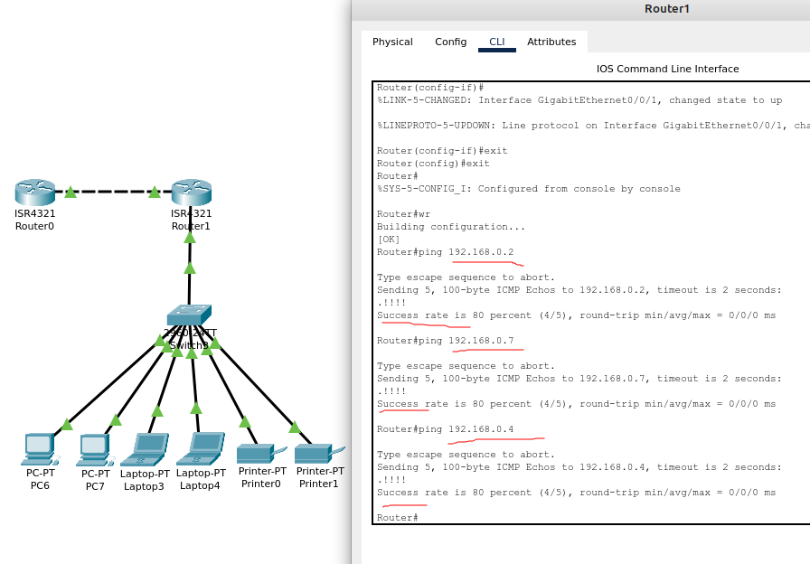
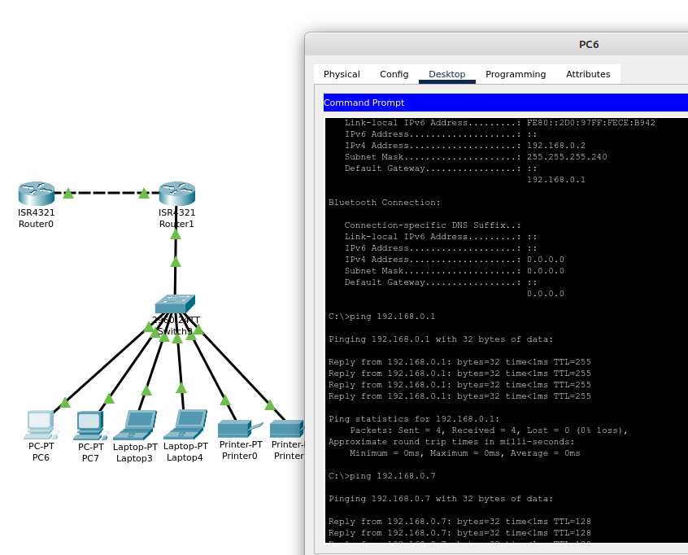
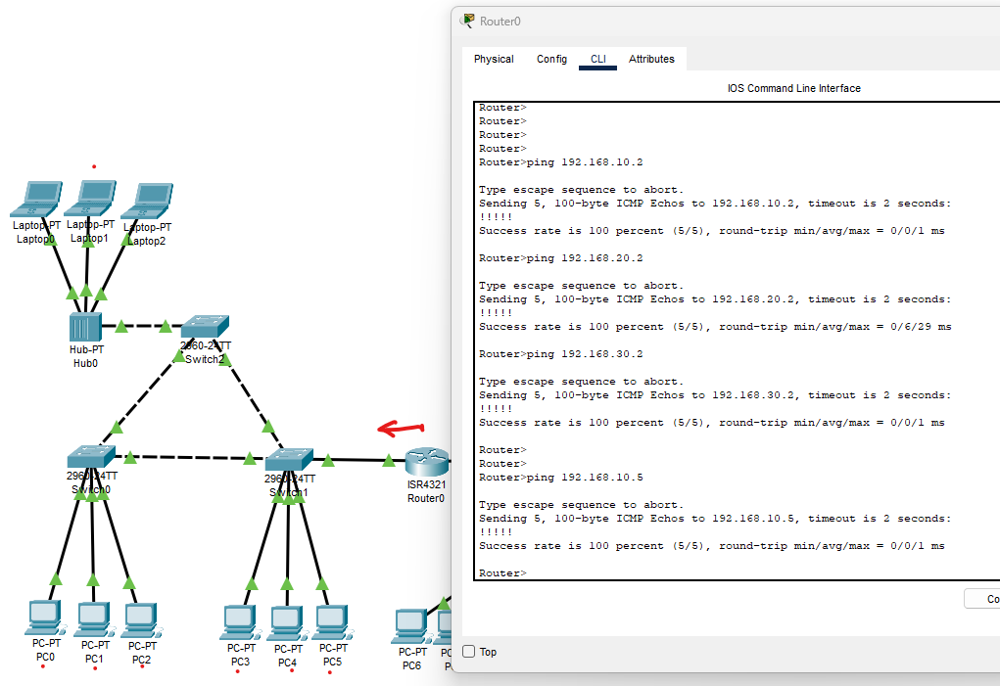
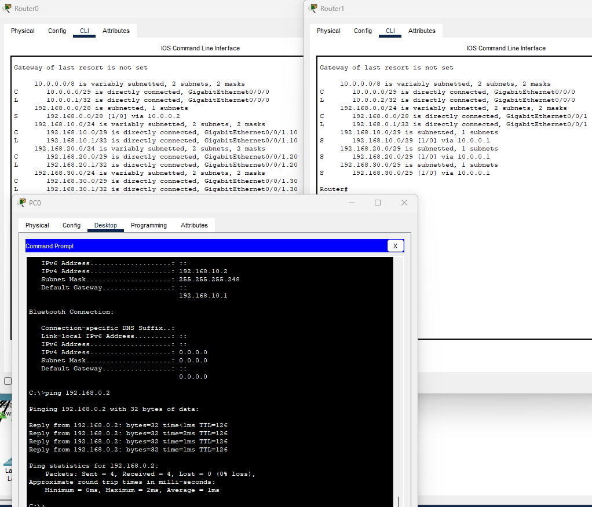

### Задание 1. Сборка локальной сети

```
Описание задания
Перед вами стоит задача собрать часть локальной сети главного офиса.

В вашем распоряжении две сети:
192.168.0.0 — предназначена для устройств главного офиса;
10.0.0.0 — предназначена для сетевого оборудования главного офиса.
Необходимо из каждой выделить минимальную подсеть для 4 сетевых устройств и 10 пользовательских устройств.

Требования к результату:
Отправьте PKT-файл с выполненным заданием.
Добавьте скриншоты с доступностью устройств между собой и ответ на вопрос.

Процесс выполнения:
- Запустите программу Cisco Packet Tracer.
- В программе загрузите предыдущую практическую работу.
- Добавьте два маршрутизатора, соедините и создайте между ними сетевую связность.
- К одному из маршрутизаторов подключите гигабитным интерфейсом ещё один коммутатор, за которым подключены два ПК, два ноутбука и два принтера. Это будет сеть главного офиса.
- Выделите минимальную подсеть для 10 пользовательских устройств.
- Настройте сетевые интерфейсы всех оконечных устройств так, чтобы была доступность всех со всеми.
- Проверьте доступность каждого типа устройств с маршрутизатора, к которому они подключены, командой ping.
- Какую минимальную маску необходимо выделить для устройств и почему? Ответ внесите в комментарии к решению задания в личном кабинете.
```

*Выполнение:*  
[Файл .pkt](_attachments/04.03-1-cpt.pkt)

Настройка маршрутизатора - доступность устройств  


Настройка хостов - связь всех со всеми  


По условиям задания, необходимо выделить минимальную подсеть для 4 сетевых устройств и 10 пользовательских устройств. 
Минимальная маска для сети 10.0.0.0 - /29 (255.255.255.248), рассчитанная на 6 хостов. 29 бит маски - адрес сети, оставшиеся 3 - хостовая часть. Соответственно, по CIDR - 2 в степени 3 даёт 8 хостов, минус сеть и бродкаст, остаётся 6 устройств.
Аналогично, для пользовательских устройств - маска /28 (255.255.255.240), 8 в степени 4 это 16 адресов, из них 14 - для подключения устройств.

### Задание 2. Подключение локальной сети
```
Описание задания
Перед вами стоит задача подключить получившуюся небольшую локальную сеть к главной сети офиса.

Требования к результату:
1. Отправьте PKT-файл с выполненным заданием.
2. Добавьте скриншоты с доступностью устройств между собой и ответы на вопросы.

Процесс выполнения:
1. Запустите программу Cisco Packet Tracer.
2. В программе загрузите предыдущую практическую работу.
3. Маршрутизатор без устройств соедините с любым коммутатором из предыдущей практической задачи домашней работы 4.2 «L2-сеть».
4. Создайте сабинтерфейсы для каждой VLAN: 10, 20, 30.
5. Назначьте IP-адреса каждому сабинтерфейсу.
6. Напишите в комментариях, какую минимальную маску необходимо указать для сабинтерфейса, обоснуйте своё решение.
7. Проверьте связь маршрутизатора с конечными устройствами в каждой VLAN командой ping.
8. Есть ли доступность между компьютерами за разными сетями маршрутизаторов? Ответ внесите в комментарии к решению задания в личном кабинете.
```

*Выполнение:*  
[Файл .pkt](_attachments/04.03-2-cpt.pkt)

Связь маршрутизатора с конечными устройствами  


Минимальная маска, которая выбрана для соответствующего vlan и сабинтерфейса - /29. Позволяет использовать в сети 6 хостов. (пять рабочих станций и шлюз). Например, в сети vlan 10, при такой настройке больше невозможно добавить устройство, все адреса разобраны.  
Доступность между компьютерами за разными сетями маршрутизаторов отсутствует, так как на них пока не настроена маршрутизация.

### Задание 3. Создание связности между сетями

```
Описание задания
Перед вами стоит задача создать доступность устройств небольшой локальной сети к главной сети офиса.

Требование к результату  
1. Отправьте файл .pkt с выполненным заданием.
2. К выполненной задаче добавьте скриншоты с доступностью устройств между собой.

Процесс выполнения
1. Запустите программу Cisco Packet Tracer.
2. В программе Cisco Packet Tracer загрузите предыдущую практическую работу из домашних заданий 4.2 "L2-сеть". и 4.3 “L3-сеть”.
3. На маршрутизаторах добавьте статические записи маршрутизации о доступности других сетей.
4. Проверьте связь с конечного устройств за одним маршрутизатором до конечного устройства за другим маршрутизатором.
5. Какой вид анонса внутренней сети вы выбрали и почему? Ответ внесите в комментарии к решению задания в личном кабинете Нетологии
```

*Выполнение:*  
[Файл .pkt](_attachments/04.03-3-cpt.pkt)

Доступность устройств  


В данном случае для анонсирования внутренней сети применяется статическая маршрутизация, т.к. имеется небольшое количество сегментов.