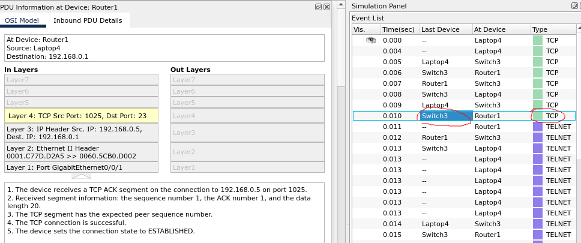
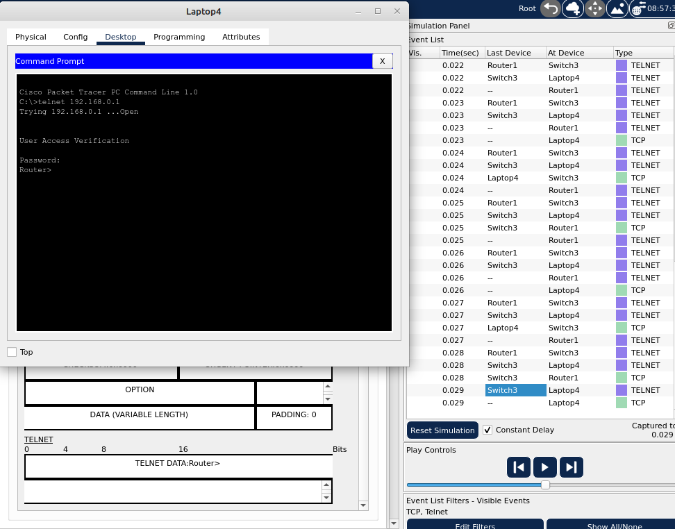
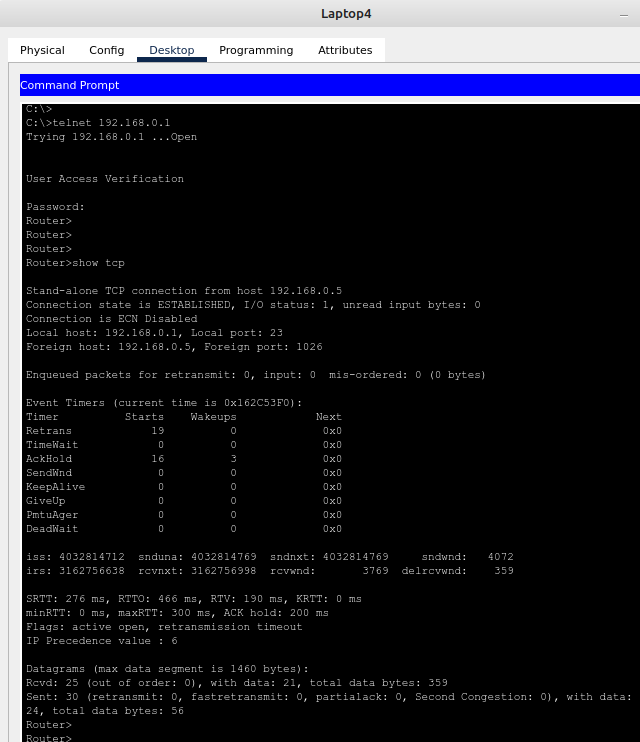
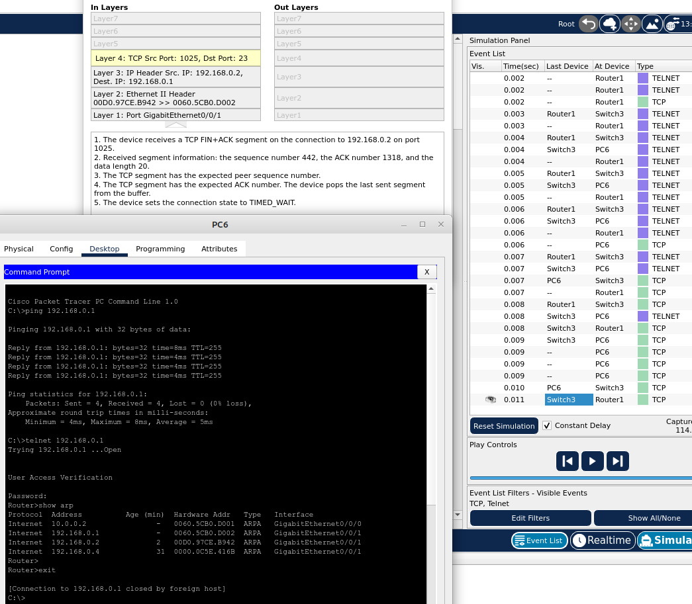
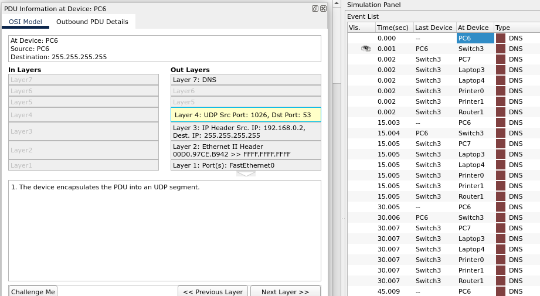

### Задание 1. Настройка маршрутизатора
```
Описание задания
Вам нужно создать и настроить подключение по telnet к маршрутизатору в главном офисе.

Требования к результату:
- Отправьте PKT-файл с выполненным заданием.
- Добавьте скриншоты с состояниями TCP-соединений и ответы на вопросы.

Процесс выполнения:
1. Запустите программу Cisco Packet Tracer.
2. В программе загрузите предыдущую практическую работу.
3. Настройте на маршрутизаторе главного офиса возможность подключения по telnet. Желательно указывать пароль в зашифрованном виде с помощью service password-encryption.
4. В Cisco Packet Tracer запустите режим симуляции и начните из командной строки с любого ПК главного офиса процесс подключения по telnet к маршрутизатору.
5. В режиме симуляции найдите момент, когда процесс трёхстороннего рукопожатия между ПК и маршрутизатором окончен и TCP-соединение установлено.
6. В командной строке выбранного ПК выполните вход на маршрутизатор с помощью ранее указанного пароля.
7. Посмотрите на маршрутизаторе все TCP-соединения. Сделайте скриншот.
8. Продолжая работать в режиме симуляции, завершите в командной строке сеанс telnet на ПК. Укажите момент, когда процесс TCP-соединения между ПК и маршрутизатором окончен.
9. Ответы внесите в комментарии к решению задания в личном кабинете.
```

*Выполнение:*  
[Файл .pkt](_attachments/04.04-1-cpt.pkt)

Настройка TELNET на роутере:  
```
Router(config)#line vty 0 4
Router(config-line)#login
Router(config-line)#password cisco
Router(config-line)#service password-encryption
```

Процесс трехстороннего рукопожатия закончен: от клиента через свитч пришёл последний ACK, он перешел в состояние ESTABLISHED:  


Работа TELNET:  


TCP соединения на маршрутизаторе:  


Завершение процесса TELNET (exit):  


### Задание 2. Анализ трафика

```
Описание задания
Вам нужно инициализировать в сети процесс отправки UDP-сообщений.

Требование к результату
К выполненному заданию добавьте скриншот со структурой пакета и ответ на вопрос.

Процесс выполнения:
1. Запустите программу Cisco Packet Tracer.
2. В программе загрузите предыдущую практическую работу.
3. Инициализируйте в командной строке любого ПК процесс отправки UDP-пакета.
4. Какие порты использует выбранный вами протокол или технология? Ответ внесите в комментарии к решению задания в личном кабинете.
```

*Выполнение:*  
Для инициализации UDP-запроса пробуем найти в своей сети DNS сервер командой `nslookup`:  
Инициатор при этом использует зарегистрированный пользовательский порт 1026 (используется для вызова удалённых процедур RPC в windows). Пунктом назначения является 53 порт, общеизвестный для службы DNS.  

