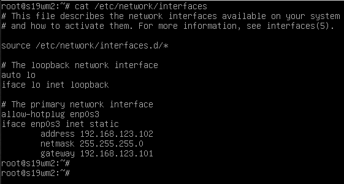

## Задание 1. Создание виртуального окружения и настройка сетевых интерфейсов
> Описание задания:  
> Перед вами стоит задача создать две виртуальные машины с операционной системой Debian и настроить управление трафиком.
> Требование к результату:  
> Вы должны создать и настроить две виртуальные машины с операционной системой Debian. К выполненной задаче добавьте скриншоты настроек IP-адресов интерфейсов, таблиц маршрутизации, конфигурации файервола и результатов выполнения всех упомянутых проверок ping.  
> Процесс выполнения:  
> 1. Запустите программу VirtualBox.
> 2. В программе VirtualBox создайте две виртуальные машины с Debian, назовите их vm1 и vm2
> 3. В VirtualBox создайте виртуальную сеть 192.168.123.0/24
> 4. В VirtualBox настройте сетевые интерфейсы vm1 так, чтобы один интерфейс имел доступ в интернет (bridge или NAT), а второй интерфейс смотрел в виртуальную сеть 192.168.123.0/24
> 5. В VirtualBox настройте сетевой интерфейс vm2 так, чтобы он смотрел только в виртуальную сеть 192.168.123.0
> 6. Для vm1: настройте статический IP адрес у интерфейса смотрящего в сеть 192.168.123.0 (адрес в сети 123.0 выберите на своё усмотрение). Настройте IP-адрес интерфейса смотрящего в вашу локальную сеть так, проверьте чтобы была доступность по ICMP c vm1 до 8.8.8.8.
> 7. Для vm2: настройте статический IP адрес у интерфейса смотрящего в сеть 192.168.123.0 (адрес в сети 123.0 выберите на своё усмотрение), шлюзом укажите IP vm1 из сети 192.168.123.0
> 8. Проверьте доступность по ICMP:
> - vm2 с vm1 по IP
> - vm1 с vm2 по IP
> 9. Приложите скриншоты результата.
> 10. Настройте пересылку трафика на vm1, чтобы с vm2 можно было отправить ICMP-запросы на 8.8.8.8 и приложите скриншот результата.
> 11. Ответ внесите в комментарии к решению задания в личном кабинете Нетологии.

*Выполнение:*  
Подготовка среды:  
```sh
 --- Создание виртмашин (vagrant) ---
mkdir ~/vgr/wm1 && cd ~/vgr/wm1
vagrant init deb32-vg

mkdir ~/vgr/wm2 && cd ~/vgr/wm2
vagrant init deb32-vg

 --- Изменение имён хостов ---
hostnamectl set-hostname s19wm1
nano /etc/hosts ->s19wm1
reboot

 --- Настройка сети ---
ls /sys/class/net
nano /etc/network/interfaces
```

Настройка iptables wm1:  
```sh
apt install iptables
#Включаем форвардинг пакетов
echo 1 > /proc/sys/net/ipv4/ip_forward
#Разрешаем доступ определенным IP из внутренней сети наружу (интернет)
iptables -A FORWARD -i enp0s8 -s 192.168.123.102 -j ACCEPT
#Запрещаем остальным доступ к интернету
iptables -A FORWARD -i enp0s8 -o enp0s3 -j DROP
#Включаем NAT
iptables -t nat -A POSTROUTING -o enp0s3 -s 192.168.123.0/24 -j MASQUERADE
#Разрешаем ответы из внешней сети
iptables -A FORWARD -i enp0s3 -m state --state ESTABLISHED,RELATED -j ACCEPT
#Запрещаем доступ снаружи во внутреннюю сеть
iptables -A FORWARD -i enp0s3 -o enp0s8 -j REJECT
#Сохраняем правила (не помогает, надо писать в сценарий при загрузке)
sysctl -w net.ipv4.ip_forward=1
```

Настройка сети virtualBox:  


Настройка сетевых адаптеров:  


Проверка доступности Google на vm1:  


Настройка сети vm2:


Доступность по ICMP:  


Результат после настройки форвардинга пакетов на vm1:  


## Задание 2. Настройка проброса портов
> Описание задания:  
> Перед вами стоит задача настроить проброс портов из локальной сети компьютера в виртуальную сеть.
> Требование к результату:  
> К выполненной задаче добавьте скриншот настроек и успешное подключение через ssh.
> Процесс выполнения:  
> 1. Запустите программу VirtualBox.
> 2. В программе VirtualBox используйте результат предыдущей практической работы.
> 3. Настройте проброс портов из локальной сети компьютера с VirtualBox через vm1 порт 12322 в виртуальную сеть VirtualBox на 22 порт vm2.
> 4. Подключитесь к vm2 по ssh через Putty как было показано на уроке. Ответ внесите в комментарии к решению задания в личном кабинете Нетологии

*Выполнение:*  
Подготовка:  
```sh
ifconfig
iptables -nvL -t nat

 --- Настройка wm1 ---
#Включаем форвардинг пакетов
echo 1 > /proc/sys/net/ipv4/ip_forward
#Пробрасываем трафик с "публичного" IP шлюза порт 12322 на IP адрес 192.168.123.102 порт 22
iptables -t nat -A PREROUTING -d 192.168.204.165 -p tcp --dport 12322 -j DNAT --to-destination 192.168.123.102:22
# Разрешаем пропускать трафик с enp0s3 через enp0s8 на 192.168.123.102 порт 22
iptables -I FORWARD 1 -i enp0s3 -o enp0s8 -d 192.168.123.102 -p tcp -m tcp --dport 22 -j ACCEPT

 --- Подключение по ssh к wm2 через wm1 ---
ssh vagrant@192.168.204.165 -p 12322
```

Изменяем настройки wm1 публичного адаптера на сетевой мост:  


Настройка статического адреса для публичного enp0s3:  


После настройки iptables на wm1:  


Результат:  
