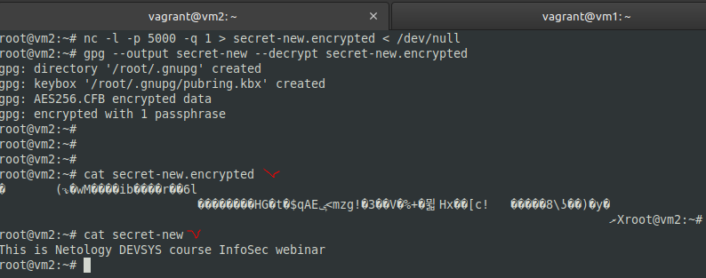

## Задание 1.
> Как вы думаете, если вы пользуетесь коммерческим VPN-сервисом для доступа к заблокированным сайтам по протоколу TLS, является ли передаваемая информация полностью защищённой?  
> Приведите ответ в свободной форме.

*Ответ:*  
Хотя протокол TLS является криптографическим протоколом, обеспечивающим защищённую передачу данных между узлами в сети, гарантировать абсолютную анонимность и защищенность данных невозможно - владелец VPN отслеживает трафик, проходящий через серверы, включая IP-адреса и объем трафика. При этом уровень анонимности и безопасности у коммерческих сервисов выше, чем у бесплатных (меньше заинтересованы в сборе и продаже данных клиентов). Так же были случаи компрометации таких VPN-сервисов, похищение приватных ключей.

## Задание 2.
> Какой протокол VPN вы выберете для подключения к VPN серверу изнутри локальной сети, в которой открыт доступ наружу только по протоколам HTTP и HTTPS?  
> Приведите ответ в свободной форме.

*Ответ:*  
В общем случае подойдет протокол, способный работать на 443 порту, например, SSL/TLS, OpenVPN (основанный на SSL/TLS). Пользователям Windows можно использовать SSTP. Есть возможность использования Clientless SSL VPN, работая через браузер.

## Задание 3.
> Какой тип VPN вы бы использовали для подключения 100 "удалённых" пользователей к серверам, находящимся в центральном офисе?  
> Объясните ваше решение.  
> Приведите ответ в свободной форме.

*Ответ:*  
В зависимости от степени озабоченности компании безопасностью:
- Наш случай - Check Point (Remote Access VPN) c двухфакторной аутентификацией, логин - пароль доменный + Aladdin 2FA;
- Можно настроить OpenVPN с авторизацией и сертификатами;
- Может быть достаточно SSL VPN с доступом к web-интерфейсу с основными сервисами компании, используя только протокол HTTPS (браузер).

## Задание 4.
> Симметричное шифрование (одинаковый ключ на зашифровку и расшифровку).  
> Создайте 2 виртуальных машины.  
> Создайте файл secret на компьютере netology1  
> root@netology1:~# echo 'This is Netology DEVSYS course InfoSec webinar' > secret
> 
> Зашифруйте файл secret в файл secret.encrypted, введя ключ.  
> root@netology1:~# gpg --output secret.encrypted --symmetric --cipher-algo AES256 secret
>  
> На машине netology2 запустите утилиту netcat на порту 5000 (от root) и сохраните то, что будет передано в порт 5000, сохраните в файл secret-new.encrypted  
> root@netology2:~# nc -l -p 5000 -q 1 > secret-new.encrypted < /dev/null
>  
> На машине netology1 отправьте файл secret.encrypted на адрес 172.28.128.60 на порт 5000  
> root@netology1:~# cat secret.encrypted | nc 172.28.128.60 5000
>  
> На машине netology2 расшифруйте файл из secret-new.encrypted в secret-new  
> root@netology2:~# gpg --output secret-new --decrypt secret-new.encrypted
>  
> В качестве ответа приведите вывод 2-х команд с хоста netology2, куда вы передали файл:  
> cat secret-new.encrypted
> cat secret-new

*Ответ:*  
Подготовка:
```sh
apt install gpg
```

