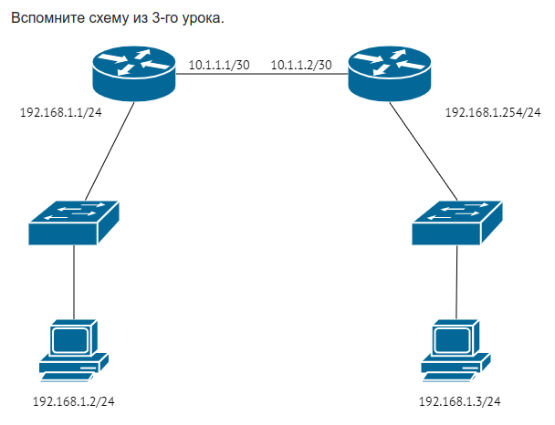

## Задание 1.
> Вы подняли на своём домашнем компьютере с IP-адресом 192.168.0.2 web-сервер.
> 
> - Получится ли у пользователей интернета открыть этот сайт?
> - Нужно ли будет вам для этого что-то сделать дополнительно?
> - Существует ли такой набор настроек провайдера, который не позволит подключение?
> Поразмышляйте над примером.
> 
> Приведите ответ в свободной форме

*Ответ:*  
1. Так как web-сервер расположен в частной сети, по умолчанию он не будет доступен из глобальной сети. 
2. Необходима настройка NAT, публикация или проброс нужных портов к серверу.
3. Провайдер может закрывать некоторые порты. Так же провайдер может предлагать только "серый" динамический ip-адрес, и без дополнительных сервисов типа "no-ip" пробросить порт к серверу в частную сеть не выйдет.

## Задание 2.
> - Узел src инициировал соединение с узлом dst.
> - На маршрутизаторе узла src была создана трансляция:
> src local IP:port	  src global IP:port	    dst IP	    protocol
> 10.0.0.2:1111	      93.15.10.2:2222	    1.1.1.1:80	tcp
> Применив знания по установке TCP сессий, ответьте на вопросы:
> 
> - Сможет ли злоумышленник доставить пакет до 10.0.0.2, отправив пакет на адрес/порт 93.15.10.2:2222 с адреса 74.5.12.4?
> - А если злоумышленник подменит source IP-адрес и сгенерирует пакет с source IP:port - 1.1.1.1:80
> Приведите ответ в свободной форме.

*Ответ:*  
1. Не сможет. Таблица трансляции явно указывает ip-адреса и порты, именно с этих адресов и портов будут ожидаться пакеты. Так же механизм TCP предоставляет поток данных с предварительной установкой соединения, поэтому 10.0.0.2 в любом случае будет ждать пакеты с адреса dst IP (1.1.1.1).
2. В большинстве случаев не сможет, он не участвовал в процедуре установления соединения, и у него нет значений Sequence Number и Acknowledgment Number, идентифицирующих TCP-соединение.
3. Где-то в сети видел описание хакерского перехвата сессии TCP с определением ISSa и ISSb и десинхронизации текущего TCP-соединения.

## Задание 3.
> - Узел src инициировал соединение с узлом dst.
> - На маршрутизаторе узла src была создана трансляция:
> src local IP:port	src global IP:port	dst IP	protocol
> 10.0.0.2:1111	93.15.10.2:2222	8.8.8.8:53	udp
> Применив знания по работе UDP, ответьте на вопросы:
> 
> - Сможет ли злоумышленник доставить пакет до 10.0.0.2, отправив пакет на адрес/порт 93.15.10.2:2222 с адреса 74.5.12.4?
> - А если злоумышленник подменит source IP-адрес и сгенерирует пакет с source IP:port - 8.8.8.8:53
> Приведите ответ в свободной форме.

*Ответ:*  
1. Не сможет, как и во втором задании, таблица трансляции явно указывает ip-адреса и порты, именно с этих адресов и портов будут ожидаться пакеты. Других трансляций в маршрутизаторе нет.
2. В случае подмены адреса и порта сможет, так как у протокола UDP нет средств установления соединения и контроля сессии, отсутствует встроенный механизм для предотвращения спуфинга.

## Задание 4.
> Найдите самую часто встречающуюся проблему при работе клиентов за NAT с протоколом FTP, связанную с особенностью работы FTP (на лекции по портам эта особенность упоминалась).
> 1. В чём выражается проблема?
> 2. Почему она возникает?
> 3. Что можно сделать, чтобы избежать этой проблемы?  
> Приведите ответ в свободной форме.

*Ответ:*  
1. Из-за особенности работы протокола FTP, самая частая проблема при использовании NAT - отсутствие соединения между клиентом и сервером.
2. Особенности работы протокола FTP:
- Использует несколько соединений (для управляющих команд - 20, 21 порты; для передачи данных - динамические). При передаче данных может быть несколько соединений, файлы передаются в обоих направлениях;
- Используются активный и пассивный режим, в зависимости от инициатора установления соединения.
3. Для нормальной работы настраивается Destination NAT (PAT), пробрасываются порты 20-21, указываются и пробрасываются динамические порты для передачи файлов. Это необходимо, так как номер порта передается сервером в управляющей команде и ничего не знает о настроенном PAT. Соответственно, если номер порта, переданный сервером, не совпадет с номером порта на внешнем интерфейсе, то клиент не сможет установить соединение.

## Задание 5*

> Немного перефразируем прошлый вопрос.
> - Поразмышляете, можно ли каким-то образом отправлять пакеты с компьютера 192.168.1.2 на компьютер 192.168.1.3 если они подключены согласно приведённой ниже схеме?
> - Если да, то что и как бы вы предложили настроить? Как и к чему нужно подключаться?
> Приведите ответ в свободной форме.

*Ответ:*  
В данной схеме отправка пакетов с 192.168.1.2 на 192.168.1.3 невозможна. Пакет не будет отправлен на шлюз роутера по умолчанию, так как подразумевается, что маршрут известен и прописан в таблице маршрутизации хоста 192.168.1.2. Используя таблицу маршрутизации и маску подсети, хост 192.168.1.2 определит, что компьютер 192.168.1.3 находится в той же подсети, отправит ARP и не получит ответа.