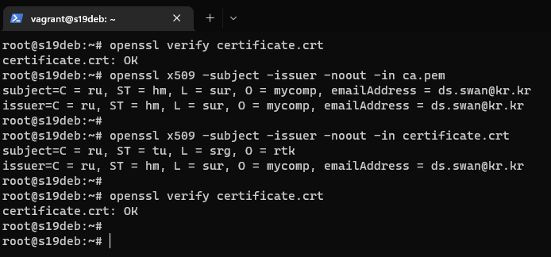

## Задание 1.
> Какие порты используются протоколами:
> Telnet;
> SSH;
> FTP;
> SNMP;
> Приведите ответ в виде списка портов.

*Ответ:*  
По умолчанию данные протоколы используют следующие порты:
- Telnet - 23 порт TCP;
- SSH - 22 порт TCP;
- FTP - 20-21, 49152-65534 порты TCP;
- SNMP - 161-162 порт UDP, если DLTS или TLS, то 10161-10162 порт UDP;

## Задание 2.
> Какой по счету уровень модели OSI называется прикладным (application layer)?
> Зашифруйте ответ с помощью ключа: {5, 21}.

*Ответ:*  
(7^5) mod 21 = 7

## Задание 3.
> Создайте свой корневой сертификат, добавьте его в систему.
> Затем подпишите им свой сертификат.
> 1. Генерируем ключ
> - openssl genrsa -out ca.key 2048
> 2. Генерируем корневой сертификат. Поля в сертификате указываем любые.
> - openssl req -x509 -new -nodes -key ca.key -sha256 -days 720 -out ca.pem
> 3. Сразу же сделаем сертификат в форме crt
> - openssl x509 -in ca.pem -inform PEM -out ca.crt
> 4. Далее установим сертификат в систему. Ниже пример для Ubuntu/Debian систем
> - sudo cp ca.crt /usr/local/share/ca-certificates/myca.crt && sudo update-ca-certificates
> 5. Приступим к выпуску самого сертификата:
> 5.1. Генерируем ключи
> - openssl genrsa -out certificate.key 2048
> 5.2. На основе ключа создаем CSR
> Обратите внимание, что subject конечного сертификата не должен совпадать с subject корневого. Хотя бы в одном поле нужно указать отличающееся значение, например в common Name или email. В противном случае конечный сертификат не будет верифицироваться, поскольку будет считаться самоподписным.
> - openssl req -new -key certificate.key -out certificate.csr
> 5.3. Подписываем CSR нашим корневым сертификатом. Тем самым создаем конечный сертификат.
> - openssl x509 -req -in certificate.csr -CA ca.pem -CAkey ca.key -CAcreateserial -out certificate.crt -days 360 -sha256
> 6. Проверяем валидность сертификата
> Эта проверка должна вернуть OK. Если вы видите failed, значит, где-то допущена ошибка.
> - openssl verify certificate.crt
> В качестве ответа приложите снимки экрана с выводом информации о сертификатах и результатом верификации:
> openssl x509 -subject -issuer -noout -in ca.pem
> openssl x509 -subject -issuer -noout -in certificate.crt
> openssl verify certificate.crt

*Ответ:*  

