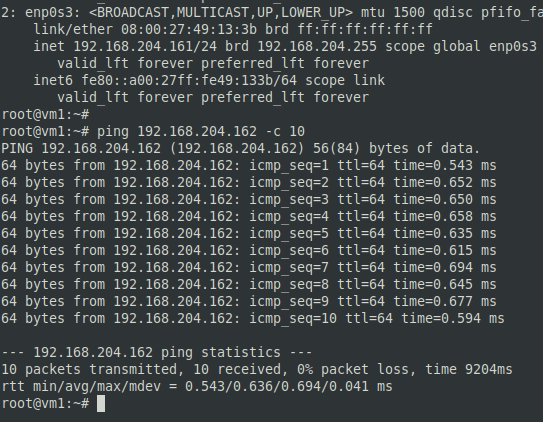
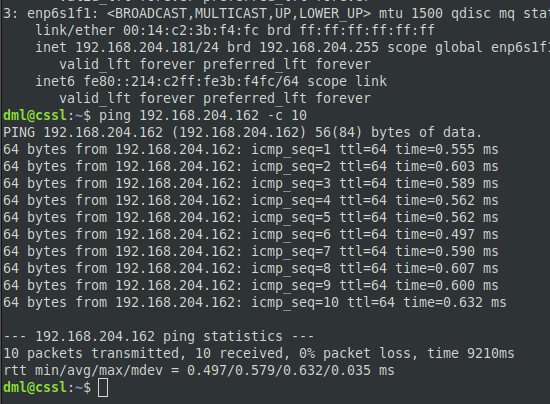
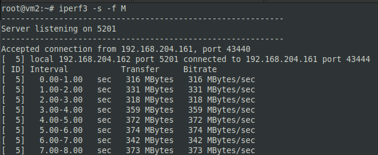
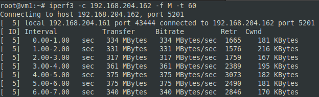
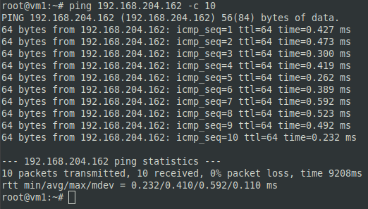
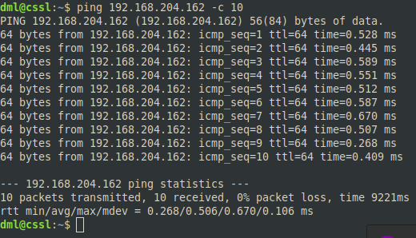

## Задание 1.
> 1. Укажите путь к файлам логов веб-сервера Nginx.
> 2. Где находится конфигурационный файл, в котором можно посмотреть / поменять эти пути?
> 3. Какой командой можно воспользоваться для просмотра файла журнала в режиме реального времени? Попробуйте найти сами, либо воспользуйтесь ссылкой.
> Приведите ответ в свободной форме.

*Ответ:*  
1. По умолчанию журналы сервера хранятся в каталоге `/var/log/nginx/`. Представлены файлами `access.log` (журнал запросов к веб-серверу) и `error.log` (ошибки Nginx).
2. `/etc/nginx/nginx.conf` - основной файл конфигурации Nginx. В секции "Logging settings" можно изменить место расположения файлов логов.
3. Просмотр файлов журналов в реальном времени - команда `tail -f  /var/log/nginx/*.log`

## Задание 2.
> Познакомьтесь со схемой сети.  
> 
> 
> 1.  `COMP1` не может обменяться данными с `COMP4`. Какую последовательность действий вы выберете для того, чтобы локализовать проблему?
> 2.  Возможно ли, чтобы при выполнении `ping 192.168.1.2` с компьютера `COMP5`, `ping` прошёл, а подключение по HTTP с `COMP5` на `COMP1` не проходило бы? Поясните свой ответ максимально детально.
> 3.  `COMP5` отправляет `ping` на `COMP1` и `COMP2`, при этом `COMP1` на `ping` отвечает, а `COMP2` - нет.
> 
> Приведите максимальное количество причин. Самую простую, но нередко встречающуюся - «У `COMP2` выдернули кабель питания» - я уже ответил за вас.
> 
> 4.  `COMP1` пингует только адреса из подсети `192.168.1.0/24` (`COMP2` и `192.168.1.1`), больше никакие адреса не пингуются. С чем это может быть связано?
> 
> _Приведите ответ в свободной форме._

*Ответ:*  
1. Последовательность действий для локализации:  
- Попытаюсь пинговать другую машину в сети `192.168.2.0/24`;
- Попытаюсь пинговать машину в своей сети `192.168.1.0/24` и шлюз по умолчанию `192.168.1.1`;
- посмотреть `traceroute`, после какого узла пакеты не передаются. После этого проверить последнее ответившее устройство и следующее за ним. Проверить физику (подключение, линки), затем канальный уровень (интерфейсы и их настройки, arpping), затем настройки firewall, forwarding, портов.

2. Ситуация возможна. Пинг проходит, значит машина рабочая. Подключение по HTTP не проходит, имеются проблемы на уровне L5-L7. Возможно, некорректно настроена работа сервиса. Проверить:
- Наличие и запуск веб-сервера;
- Настройки firewall на возможные блокировки;
- Соответствие портов сервера ожиданиям (например, может быть 8080, 8081, 80, 81 и т.д.).

3. Возможные причины:
- Физика (кабель, wi-fi);
- Настройки сети на COMP2;
- Firewall на COMP2 блокирует ICMP пакеты;
- Проверить настройки firewall на маршрутизаторах;
- Блокировка MAC-адрес COMP2 маршрутизатором `10.1.1.1`.

4. Возможно, на COMP1 в настройках не прописан Gateway. Запросы, отправляемые на адреса вне диапазона сети 1теряются, так как не могут найти маршрут до адресата.

## Задание 3*.
> Используя схему из Задания 2, попробуйте ответить на вопросы:  
> 1.  `COMP1` и `COMP2` оба пингуют `10.1.1.2`, однако не пингуют `192.168.2.1` и прочие адреса из `192.168.2.0/24`. Как вы думаете, что не так, и как это можно исправить?
> 2.  Какими способами мы можем сделать так, чтобы `COMP2` не смог общаться ни с кем кроме своей локальной сети? (Приведите вариант с настройками самого `COMP2` и попробуйте придумать, можно ли что-то сделать на маршрутизаторе `192.168.1.1`)
> 3.  Как вы думаете, что будет происходить при попытке провести `ping` с `COMP5` на `192.168.2.3`?  
> _Приведите ответ в свободной форме._****

*Ответ:*  
1. На маршрутизаторе `10.1.1.2` не настроен статический NAT. После настройки сеть `192.168.2.0/24` станет доступна.
2. Убрать в сетевых настройках COMP2 шлюз по умолчанию. На маршрутизаторе `192.168.1.1` отбросить (DROP) трафик от COMP2, идущий не в свою сеть. Полностью отключить NAT на `192.168.1.1`, вся сеть станет изолированной.
3. Внутри сети трафик пойдет (не доходя до маршрутизатора). Поэтому пинг будет, при условии корректности сетевых настроек машин, наличия физического подключения и правильной настройки firewall на работу с ICMP.

## Задание 4*.
> -   Сделайте `ping` с одной виртуальной / физической машины на другую.
> -   Используя [описание утилиты iperf](https://losst.ru/kak-polzovatsya-iperf), загрузите канал между двумя виртуальными машинами на максимум, например, на 60 секунд, в процессе загрузки повторите `ping`.
> -   Изменились ли цифры в ответе команды `ping`? Почему? Есть ли разница между физическими и виртуальными машинами?  
> _Приведите скриншоты/ответы команд до и во время высокой загрузки каналов._

*Ответ:*  
- Пинг с виртуальной vm1 на виртуальную vm2:  
  

- Пинг с физического сервера cssl на виртуальную vm2:  
  

- Запуск iperf3 клиента и сервера: 
  
  

-----
- Пинг с виртуальной vm1 на виртуальную vm2 с загрузкой канала:  
  

- Пинг с физического сервера cssl на виртуальную vm2 с загрузкой канала:  
  

*Вывод:*  
- Значения времени ответов между физической и виртуальной машиной изменилось незначительно, практически в пределах погрешности, как без загрузки, так и с загрузкой канала;
- Значения среднего времени приёма-передачи изменяются примерно на 0,2 мс при загруженном канале, причем значение становиться меньше. Закономерностей не увидел.