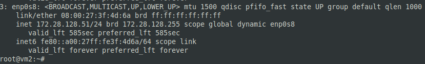
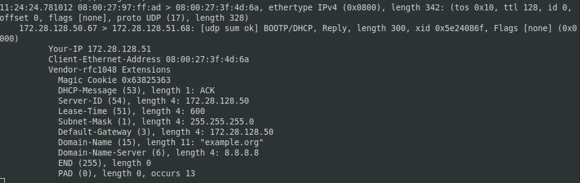
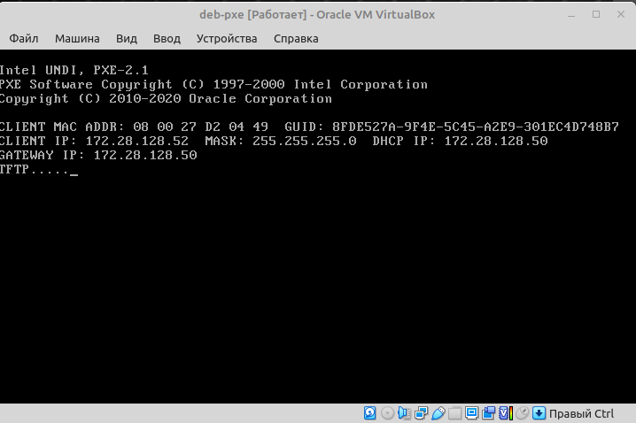
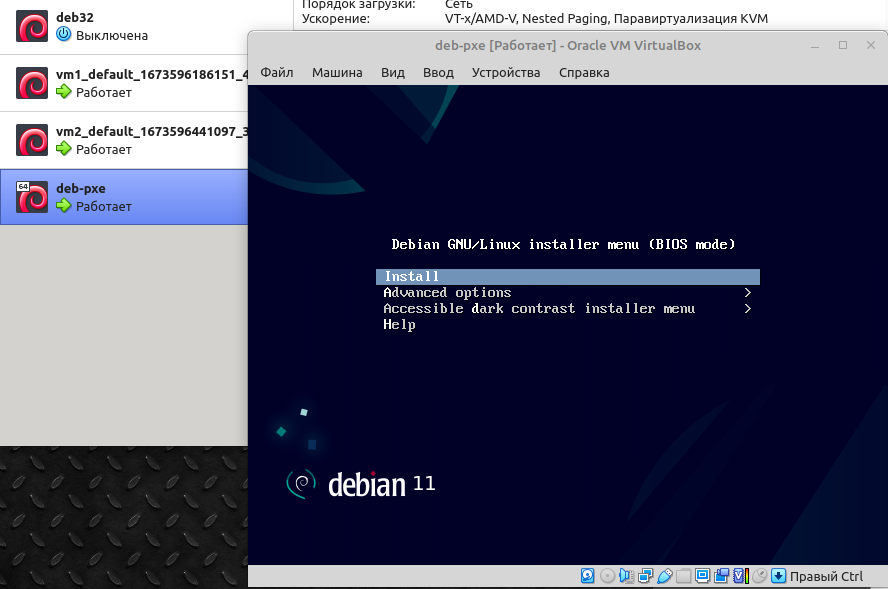

## Задание 1.
> Для чего служит протокол `DHCP`?
> Может ли работать сеть без `DHCP-сервера`?
> _Приведите ответ в свободной форме._

*Ответ:*  
Протокол DHCP служит для динамического автоматического выделения IP адресов сетевым устройствам и добавления при этом ряда опций. Сеть может работать без DHCP, в этом случае всем участникам придется настраивать сетевые параметры вручную.

## Задание 2.
> На каком порту/портах работает `DHCP`?
> _Приведите ответ в свободной форме._

*Ответ:*  
DHCPv4 работает на портах 67/68 UDP.  
DHCPv6 работает на портах 546/547 UDP

## Задание 3.
> Какие настройки можно произвести используя опции?
> Назовите 5.
> _Приведите ответ в свободной форме._

*Ответ:*  
- `option arp-cache-timeout` - задает тайм-аут для ARP-кэша в секундах;
- `option broadcast-address` - задает широковещательный адрес для клиента;
- `option default-tcp-ttl` - устанавливает стандартное значение TTL для TCP-сегментов;
- `option host-name` - передает клиенту строку, которую тот должен установить в качестве hostname, если оно еще не задано;
- `option ip-forwarding` - устанавливает возможность переадресации IP-пакетов на клиенте.

## Задание 4.
> Сконфигурируйте сервер `DHCP`.
> _Пришлите получившийся конфигурационный файл._

*Ответ:*  
```sh
apt install isc-dhcp-server
```

```sh
nano /etc/default/isc-dhcp-server
---
DHCPDv4_CONF=/etc/dhcp/dhcpd.conf
DHCPDv4_PID=/var/run/dhcpd.pid
INTERFACESv4="enp0s8"
INTERFACESv6=""
```

```sh
nano /etc/dhcp/dhcpd.conf
---
option domain-name "example.org";
option domain-name-servers 8.8.8.8;

default-lease-time 600;
max-lease-time 7200;

ddns-update-style none;

authoritative;

subnet 172.28.128.0 netmask 255.255.255.0 {
  range 172.28.128.51 172.28.128.100;
  option routers 172.28.128.50;
}
```

```sh
systemctl start isc-dhcp-server
systemctl status isc-dhcp-server
```



## Задание 5*.
> Поймайте в сети пакеты `DHCP` любым сниффером.
> _Пришлите скриншот пойманного одного пакета с объяснением, что это за пакет, какой шаг получения сетевых настроек._

*Ответ:*  
```sh
apt install tcpdump
```

```sh
tcpdump -i enp0s8 udp port 67 or port 68 -vvv -e -n
```

  

Пакет DHCPASK, последний пакет - подтверждение получения сетевых настроек от сервера DHCP. Обмен сообщениями закончен, и клиент должен применить полученные настройки.

## Задание 6*.
> Сконфигурируйте сервер `PXE`, выложите любой образ.
> _Пришлите скриншот клиента, который получил настройки и подключился к `PXE-серверу`._

*Ответ:*  
```sh
apt install tftpd-hpa
nano /etc/default/tftpd-hpa
```

```sh
# /etc/default/tftpd-hpa

TFTP_USERNAME="tftp"
TFTP_DIRECTORY="/srv/tftp"
TFTP_ADDRESS="172.28.128.50:69"
TFTP_OPTIONS="--secure"
```

```sh
systemctl restart tftpd-hpa
systemctl status tftpd-hpa
cd /srv/tftp
wget https://deb.debian.org/debian/dists/bullseye/main/installer-amd64/current/images/netboot/netboot.tar.gz
tar xvzf netboot.tar.gz
nano /etc/dhcp/dhcpd.conf
```


```
# dhcpd.conf

# option definitions common to all supported networks...
allow booting;
allow bootp;

option domain-name "example.org";
option domain-name-servers 8.8.8.8;

default-lease-time 600;
max-lease-time 7200;

authoritative;

# This is a very basic subnet declaration.

subnet 172.28.128.0 netmask 255.255.255.0 {
  range 172.28.128.51 172.28.128.100;
  option routers 172.28.128.50;
  next-server 172.28.128.50;
  filename "pxelinux.0";
}
```

```sh
systemctl restart isc-dhcp-server
```

  

