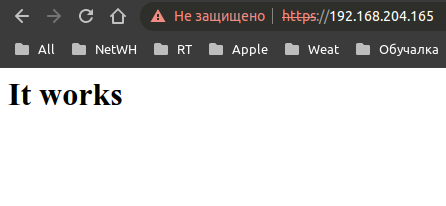
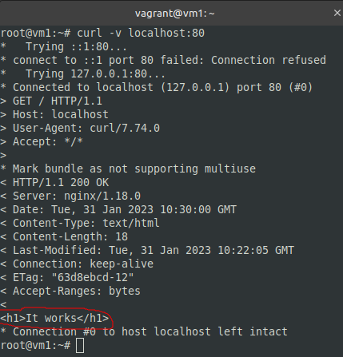
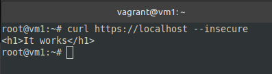
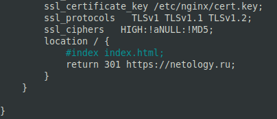
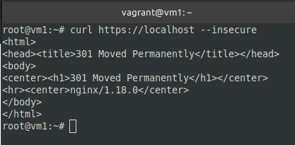
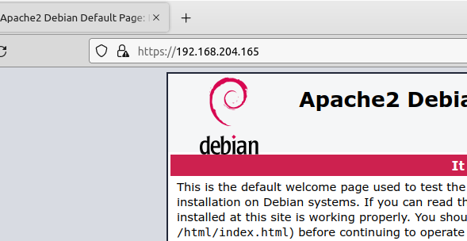

## Задание 1.
> Какие коды ответов HTTP лучше соответствуют описанным ситуациям?
> -   Данная страница не найдена;
> -   Страница была перенесена на новый сайт;
> -   Ресурс удален;
> -   Пользователь не авторизован для просмотра страницы;
> -   Превышен лимит запросов от пользователя.
> _Приведите ответ в свободной форме._

*Ответ:*  
- 404 - Not Found;
- 301 - Moved Permanently;
- 410 - Gone;
- 401 - Unauthorized;
- 429 - Too Many Requests

## Задание 2.
> 1.  Установите Nginx.
> `sudo apt-get install nginx`
> 2.  Сгенерируйте сертификат для него указав `localhost` в качестве `CN`.
> `sudo openssl req -x509 -nodes -newkey rsa:4096 -keyout /etc/nginx/cert.key -out /etc/nginx/cert.pem -days 365`
> 3.  Отредактируйте модуль `http` в файле `/etc/nginx/nginx.conf`.
> ```
> http {
>     gzip on;
>     server {
>         listen 80 default_server;
>         root   /var/www/public;
>         listen  443 ssl http2 default_server;
>         server_name  localhost;
>         ssl_certificate  /etc/nginx/cert.pem;
>         ssl_certificate_key /etc/nginx/cert.key;
>         ssl_protocols   TLSv1 TLSv1.1 TLSv1.2;
>         ssl_ciphers   HIGH:!aNULL:!MD5;
>         location / {
>             index index.html;
>         }
>     }
> }
> ```
> 4.  Создайте файл `/var/www/public/index.html` c содержимым.
> ```
> It works
> ```
> 5.  Зайдите на страницу в браузере, пропустив сообщение о неработающем сертификате.
> _Пришлите скриншот работающей страницы [https://localhost](https://localhost/)._

*Ответ:*  
```sh
nano /etc/nginx/nginx.conf
mkdir /var/www/public
nano /var/www/public/index.html

service nginx stop
service nginx start
service nginx status

apt install curl
curl -v localhost:80
curl https://localhost --insecure
```

  
  


## Задание 3.
> Измените конфигурацию сервера добавив переадресацию c Вашего сервера на сайт `netology.ru`.
> ```
> location / {
>   return 301 https://netology.ru;
> }
> ```
> _Используя curl сделайте запрос к своему серверу и в качестве ответа пришлите скриншот с 301 ответом._

*Ответ:*  
```sh
nano /etc/nginx/nginx.conf
service nginx stop
service nginx start
curl https://localhost --insecure
```

  


## Задание 4*.
> Используя документацию [https://httpd.apache.org/docs/current/](https://httpd.apache.org/docs/current/) установите `apache2` веб-сервер.
> Сделайте задание 2, добившись аналогичной работы сервера.
> _Пришлите получившуюся конфигурацию в качестве ответа._

*Ответ:*  
[Статья](https://clck.ru/33Qrfe)

  

[apache2.conf](_attachments/04.12-4-apache2.conf)  
[000-default.conf](_attachments/04.12-4-000-default.conf)
