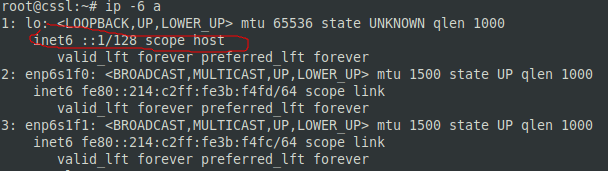

## Задание 1.
> Какая нотация используется для записи IPv6-адресов:
> - какие и сколько символов?
> - Какие разделители?
> Приведите ответ в свободной форме.

*Ответ:*  
Адрес IPv6 состоит из восьми четырёхзначных чисел, записанных в шестнадцатеричном формате, в качестве разделителя используется двоеточие. Существуют правила, по которым можно сократить запись, убрав или сгруппировав незначащие ведущие нули

## Задание 2.
> Какой адрес используется в IPv6 как loopback?  
> Приведите ответ в свободной форме.

*Ответ:*  
Адрес интерфейса loopback IPv6 :`:1/128` или `::1`  

## Задание 3.
> Что такое Unicast, Multicast, Anycast адреса?  
> Приведите ответ в свободной форме.

*Ответ:*  
- Unicast адреса служат для идентификации одного хоста.
- Multicast адреса используется для отправки на группу хостов пакетов, с доставкой их каждому узлу.
- Anycast адреса назначаются группе хостов, но пакет, отправленный на такой адрес, доставляется на самый ближний хост.

## Задание 4.
> Используя любую консольную утилиту в Linux, получите IPv6-адрес для какого либо ресурса.  
> В качестве ответа приложите скриншот выполнения команды.

*Ответ:*  
IPv6-адрес можно получить, используя `ping6`, `nslookup`, `dig`, `host`.  
  

## Задание 5.
> - Как выглядят IPv6-адреса, которые маршрутизируются в интернете?  
> - Как выглядят локальные IPv6 адреса?  
> Приведите ответ в свободной форме.

*Ответ:*  
- Глобальные IPv6 адреса начинаются с 2 (2a06:98c1:3122:e000:: - адрес netology.ru);
- Локальные IPv6 адреса начинаются с f (fe80::214:c2ff:fe3b:f4fc - адрес одного из сетевых адаптеров сервера).